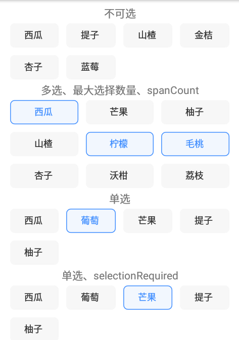
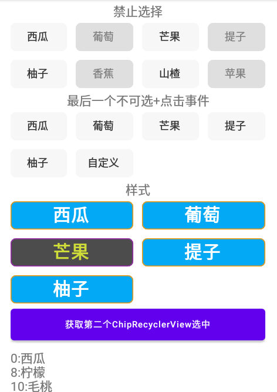

# ChipRecyclerView

## 演示
|||
|:---:|:---:|
|||


 ## Gradle
[](https://jitpack.io/#caohao9808/ChipRecyclerView)
 ```
  implementation 'com.github.caohao9808:ChipRecyclerView:0.0.1'
 ```
 jitpack还要求在工程根目录的`build.gradle`中添加如下：
 ```
 allprojects {
     repositories {
         ...
         maven { url 'https://jitpack.io' }
     }
 }
 ```
